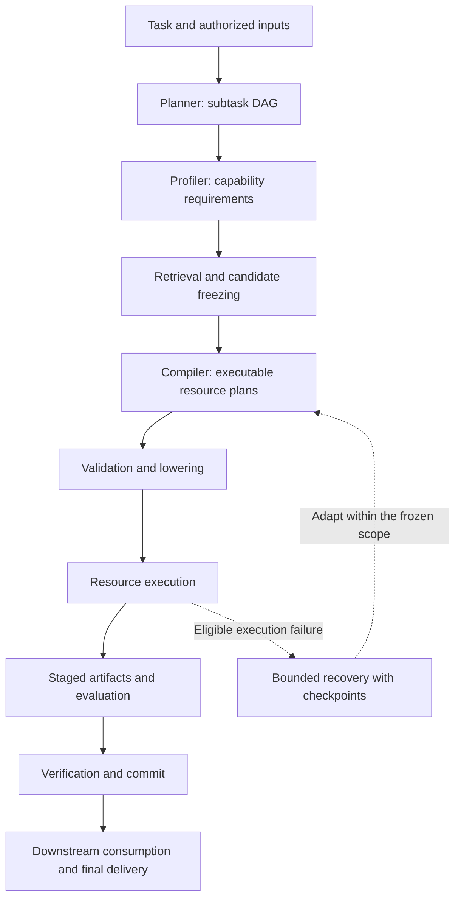

# SGAR

SGAR is a research framework for composing task-specific workflows from a shared pool of **Models, Agents, Tools, and Skills**. It turns a natural-language request and explicitly supplied inputs into a graph of subtasks, retrieves candidate resources, compiles executable plans, and evaluates the resulting artifacts before committing and delivering them.

The framework separates **what a task requires** from **how resources carry it out**: the Planner defines subtask responsibilities and dependencies, while the Compiler chooses resource operations, binds inputs, and specifies concrete execution and output contracts.

## How it works



This diagram describes the logical pipeline. A subtask may use multiple resources and execution steps; it is not restricted to a single model or tool. Independent subtasks can execute when their declared dependencies are satisfied.

| Stage | Responsibility |
| --- | --- |
| **Planner** | Decompose the public request into subtasks with responsibilities, input requirements, dependencies, expected outputs, and acceptance criteria. |
| **Profiler** | Describe each subtask's capability requirements from its task and input contracts, without selecting resources from the pool. |
| **Retrieval and Router** | Retrieve candidates, check applicable runtime conditions, and freeze a candidate pool for each subtask revision. Retrieval ranking is not the final execution plan. |
| **Compiler** | Select resources and operations from the frozen pool; define arguments, input bindings, step dependencies, and concrete output contracts. |
| **Validation and lowering** | Check the proposed plan against resource interfaces, input permissions, dependency rules, and supported output transformations; produce runtime instructions. |
| **Runtime** | Execute the resource plan and collect its outputs. When enabled by policy, bounded recovery can adapt a plan while preserving completed checkpoints and side-effect restrictions. |
| **Evaluator and artifact lifecycle** | Check actual outputs against structural contracts and scoped semantic requirements, then verify and commit accepted artifacts. |
| **Delivery** | Make committed artifacts available to dependent subtasks and produce the requested final deliverables. |

## Resource model

Resources are described by manifests and exposed through declared capabilities and interfaces.

| Resource | Role in a workflow |
| --- | --- |
| **Model** | Generate or transform content through a configured model endpoint. |
| **Agent** | Execute a packaged agent configuration using its declared runtime, capabilities, and resource scope. |
| **Tool** | Invoke a concrete operation with explicit arguments and a native output interface. |
| **Skill** | Supply reusable instructions and declared supporting references to a compatible execution context. |

The Compiler can combine these resource types within a subtask. Resource availability and the accepted plan determine which combinations are executable; the framework does not impose one fixed resource topology on every task.

The catalog and execution packages live in [`Pool/resources/`](Pool/resources/). Retrieval indexes and resource mappings live in [`Pool/index_meta/`](Pool/index_meta/).

## Contracts and execution boundaries

- **Task requirements and implementation choices remain separate.** Planner-level requirements define the intended result. Compiler-level contracts specify how a selected plan will produce it; they do not replace the original requirements.
- **Inputs are explicit and scoped.** Nodes consume declared public inputs or authorized upstream artifacts. A node does not automatically receive every file or every other node's output. Tasks supported by the task text alone can remain material-free.
- **Output compatibility is checked before execution.** Native resource contracts and supported transformations inform whether an output is realizable. A textual capability description is not treated as a machine-readable Schema guarantee.
- **Generated content is evaluated before handoff.** The lifecycle is staging, evaluation, verification and commit, then downstream consumption or final delivery. An intermediate step output is not automatically a committed node deliverable.
- **Recovery is bounded.** Recovery follows configured budgets and checkpoint constraints. It does not grant new material permissions or silently reopen a frozen candidate pool. Policies may disable recovery entirely.
- **Failure is a valid outcome.** Invalid plans, insufficient capabilities, runtime failures, and rejected artifacts are reported with their stage and diagnostic evidence rather than presented as successful delivery.

Structural checks establish interface and contract consistency. Semantic evaluation additionally considers the public task, the current subtask's responsibilities, its actual inputs, and the produced content. Neither check establishes that every future model response will be correct.

## Getting started

### 1. Prepare the environment

Use Python **3.11** and install the dependencies required by the runtime and retrieval components. The dependency declarations are in [`requirements-dev.txt`](requirements-dev.txt) and [`requirements-index.txt`](requirements-index.txt); they are not a platform-independent environment lock.

A runnable setup also needs:

- a configured provider and model registry compatible with the required response formats;
- the embedding model expected by the retrieval indexes, available at a configured local path;
- the runtime dependencies required by the resources you intend to execute, including Docker where applicable;
- any readiness records and runtime assets required by the selected configuration.

See the [environment and Linux setup guide](docs/LINUX_MIGRATION.md) for concrete setup steps and external asset requirements. Model weights, API credentials, and historical run directories are not bundled with the source.

### 2. Configure the project

Start from the example files and fill in the provider settings and paths for your environment:

```bash
cp .env.example .env
cp sgar_mvp/config.example.json sgar_mvp/config.json
```

Keep credentials in the local environment or private configuration. Review the model, runtime, and recovery settings before running. A [Linux configuration example](sgar_mvp/config.linux.example.json) is also provided.

### 3. Run a task

From the repository root, inspect the supported arguments:

```bash
python -B sgar_mvp/main.py --help
```

Run a task with an explicitly authorized input:

```bash
python -B sgar_mvp/main.py \
  --query "Summarize the supplied document and identify its main claims." \
  --input document=/absolute/path/to/inputs/document.txt \
  --public-input-root /absolute/path/to/inputs
```

Alternatively, use a request manifest to keep the task and its input declarations together:

```bash
python -B sgar_mvp/main.py \
  --request-manifest /absolute/path/to/inputs/request.json \
  --public-input-root /absolute/path/to/inputs
```

Request parsing and input declarations are defined in [`task_invocation.py`](sgar_mvp/src/task_invocation.py). Task execution can invoke paid model endpoints and the resources permitted by the configuration.

## Inspecting a run

The terminal presents stage progress, resource selections, execution outcomes, and the primary cause of a failed run. The run directory retains the detailed evidence needed to inspect how an outcome was produced:

| Output | Contents |
| --- | --- |
| `pipeline.log` | Task and subtask details, profiler output, candidate information, Compiler proposals and accepted plans, execution output, and diagnostics. |
| `experiment_report.md` | A readable report of the run and its recorded outcomes. |
| `run_manifest.json` | Run identity, status, and references to recorded artifacts and delivery evidence. |
| `evaluation/` | Evaluation evidence and decisions for produced artifacts. |

Use the paths reported at the end of the run to locate its logs and deliverables. Recorded model-call accounting supports inspection of usage and cost alongside execution outcomes.

The run validator checks recorded run consistency:

```bash
python -B -m sgar_mvp.src.run_validator /absolute/path/to/run
```

Run validation and internal evaluation are distinct from an independent benchmark's correctness checks.

## Research workflows

The single-task entry point is [`sgar_mvp/main.py`](sgar_mvp/main.py). For experiments described by a suite manifest, use the batch entry point:

```bash
python -B -m sgar_mvp.real_case_batch \
  --suite /absolute/path/to/suite.json \
  --output-root /absolute/path/to/experiment-runs
```

The batch implementation is in [`sgar_mvp/real_case_batch.py`](sgar_mvp/real_case_batch.py). It coordinates individual runs and records their outcomes. Public task fixtures and associated research scripts support targeted validation; this distribution does not contain the complete historical development test suite.

SGAR is a research implementation. A completed run establishes that the configured pipeline accepted and delivered its output; it does not by itself establish independent task correctness. Experiments should retain their inputs, configuration, resource selections, outputs, and external evaluation results so that task quality can be assessed separately from framework execution success.

## Repository layout

```text
sgar_mvp/
  main.py                    Single-task pipeline entry point
  real_case_batch.py         Research batch runner
  src/                       Planning, retrieval, compilation, execution,
                             recovery, evaluation, and artifact lifecycle
  config/                    Runtime policies and registries
  config.example.json        Configuration template
  config.linux.example.json  Linux configuration template
  docker/                    Runtime image definitions
  scripts/                   Resource preparation and research utilities
Pool/
  resources/                 Model, Agent, Tool, and Skill definitions/packages
  index_meta/                Retrieval indexes and resource mappings
retrieve.py                  Retrieval implementation
retrieval_profiles.py        Retrieval profile definitions
build_index.py               Index construction utility
cost_calculator.py           Cost calculation utilities
requirements-*.txt           Dependency declarations
.env.example                 Environment variable template
tests/fixtures/              Public task inputs used by retained utilities
docs/                        Environment and resource documentation
```

## Documentation and licensing

- [Environment and Linux setup](docs/LINUX_MIGRATION.md)
- [Observed Windows environment](docs/WINDOWS_ENVIRONMENT_OBSERVED.json)
- [Third-party resource provenance and licensing](docs/third-party-resources.md)

Third-party resource licenses and model service terms apply independently. Consult the resource packages' license and notice files and the provenance document before redistribution. A repository-wide project license has not yet been specified.
