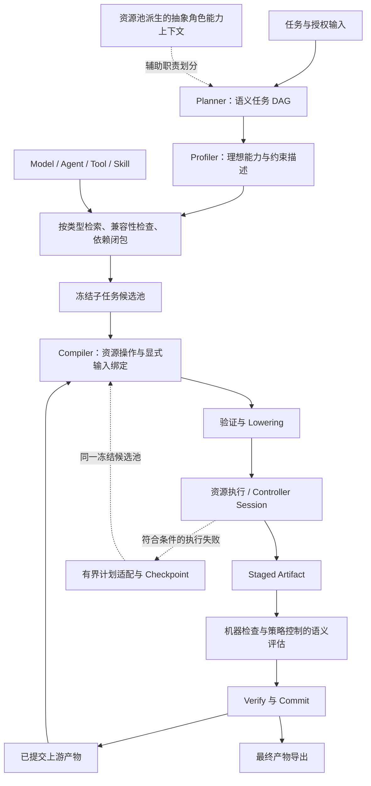

# SGAR 本地项目核心逻辑分析：框架、模块与完整工作流

> 用途：作为后续 GPT 理解项目、讨论论文定位和组织 Method/Experiments 的事实底稿。本文依据本地代码、实际配置和少量运行记录整理，不是论文结果报告，也不把设计目标当作已经验证的性能结论。
>
> 分析日期：2026-09-19。源码基准：`f53dfeadf4e00aaeb4701a715e36fb97c6583631`。开始检查时工作区无已跟踪修改。本文中的模型名称是本地配置标识，不代表对外部服务能力或可用性的独立确认。仓库同时使用 SGAR 和 S-GAR；未从当前入口文档确认正式英文全称，本文不自行补全。

## 1. 先建立对项目的整体理解

SGAR 是一个**从共享异构资源池中，为具体任务构建可执行工作流的研究框架**。输入是自然语言任务、显式提供的材料以及交付要求；输出是可追溯的交付物，或者包含失败阶段与原因的结构化终态。

资源池中的主要资源有四类：Model、Agent、Tool、Skill。SGAR 将任务分解、资源检索、资源组合、真实执行和产物管理串成一条完整链路：

```text
请求和授权材料
  → 语义任务 DAG
  → 每个子任务的理想能力描述
  → 按资源类型检索、兼容性检查与依赖闭包
  → 冻结每个子任务的候选池
  → 编译子任务内部的资源执行计划
  → 结构验证、输出可实现性检查与 lowering
  → 调度真实资源 / 有界 Controller Session
  → 输出暂存、检查和可选语义评估
  → 验证、提交、向下游移交
  → 最终交付
```

项目最值得作为论文主线讨论的是：**将“任务需要完成什么”与“资源具体如何完成”分离，通过两层工作流、显式数据绑定和可检查的执行契约连接起来。**

需要避免三个概念混淆：

- Planner 的角色节点不等于资源池中的 Agent。一个“数据分析”节点可以由 Tool 完成，也可以由 Model、Agent 或组合计划完成。
- 检索结果不等于执行计划。排在第一的资源只是候选，Compiler 还要判断接口、输入、输出、组合关系和成本。
- 程序顺利结束、内部产物检查通过、独立 benchmark 答对，是三个不同层次的结果。

目前没有从正式主路径发现 SGAR 自身的参数训练、梯度更新或强化学习训练循环。这里的核心是基于现有模型和资源进行推理时编排。代码中的 `TrainingLabel`、utility、memory 字段不能单独作为“系统已经在线学习”的证据。

## 2. 方法研究问题与边界

从实现反推，SGAR 面对的问题可以描述为：给定一个包含多种职责和材料依赖的任务，如何从异构资源池中找出合适资源，并构成能够真实执行、传递有效中间结果、最终满足任务要求的工作流。

这一问题包含几个相互关联的困难：

| 困难 | SGAR 的实现回应 | 仍然需要验证的方面 |
| --- | --- | --- |
| 用户需求与资源描述不在同一语义空间 | Profiler 把子任务契约转为“理想资源”描述 | 相比直接检索是否提高候选覆盖率 |
| 语义相关不代表接口可用 | 类型化资源描述、兼容性证据、编译验证 | 描述是否完整，实际运行环境是否可靠 |
| 单一资源不能覆盖整个子任务 | Compiler 构造多步骤资源计划 | 是否比单模型或简单工具调用更有效 |
| 任务分解容易过粗或过度碎片化 | 按独立职责、产物和真实交接拆分 | 分解质量与控制开销之间的权衡 |
| 上下游看似连接，实际没有数据流 | 语义边、执行边、artifact handle 和输入绑定 | 大文件、多模态和长链路覆盖情况 |
| 输出格式正确但内容有误 | 保留原始需求，结构检查与语义评估分离 | 语义评估的可靠性及外部正确率 |
| 失败后无限扩展导致不可复现 | 候选池冻结、有限适配、checkpoint | 固定候选范围造成的召回损失 |
| 成本被控制过程或重试隐藏 | 请求级账本、价格快照、阶段分解 | 全流程性价比是否优于基线 |

这些是由代码支持的设计动机和待检验假设，不是已经成立的创新性或领先性结论。是否具有相对已有工作的独特性，还需要单独完成文献比较。

## 3. 总体架构：两层图与三类职责

### 3.1 任务图和资源图

第一层是 Planner 生成的语义任务图：

\[
G_T=(V_T,E_T).
\]

节点 \(v_i\) 表示一个有明确角色意图、主要职责、输入要求、输出和验收条件的子任务。边表示一个节点确实需要消费另一个节点的产物。

第二层是 Compiler 为单个节点构造的资源执行图：

\[
G_i=(S_i,D_i),\qquad R_i\subseteq C_i\subseteq\mathcal R.
\]

\(S_i\) 是执行步骤，\(D_i\) 是步骤间依赖，\(C_i\) 是已冻结候选池，\(R_i\) 是实际选用资源，\(\mathcal R\) 是本次运行使用的资源池快照。一个步骤还可以包含具有固定可调用工具范围的 Controller Session。

这组符号是对代码的说明性形式化，不表示仓库实现了全局组合优化求解器。



图中的回边表达跨子任务的产物移交和失败处理，不表示 Planner 的任务 DAG 含环。

### 3.2 控制、执行与证据职责

| 职责 | 主要组成 | 回答的问题 |
| --- | --- | --- |
| 控制 | Planner、Profiler、检索协调器、Router、Compiler、恢复控制器 | 拆什么任务、选什么候选、怎样组成计划 |
| 执行 | Orchestrator、ResourceRuntime、executor、Controller、运行环境 | 怎样把计划变成真实资源调用 |
| 产物与证据 | ArtifactLifecycle、Evaluator、Delivery、各类 ledger | 输出是否可接收、谁可消费、如何核验与复现 |

控制模型和执行模型可以不同。控制角色由策略指定；业务执行资源由 Compiler 在候选池内选择。某个模型用于 Planner，不代表所有执行节点都自动使用这个模型。

## 4. 资源池的设计与离线准备

### 4.1 统一描述，保留不同执行语义

资源 manifest 大体包含：

| 字段 | 作用 |
| --- | --- |
| `resource_id` / `resource_type` / `status` | 身份、类型及状态 |
| `capability` | 能力摘要、核心操作、适用问题空间、领域 |
| `constraint` | 输入输出条件、限制和环境要求 |
| `io.input_contract` / `io.output_contract` | 可调用接口和原生输出契约 |
| `routing` | 资源族、依赖槽位或依赖建议 |
| `execution` | runtime、入口、执行状态 |
| `type_specific` | 模型能力、Agent 卡片、Tool 类型、Skill 包等类型专属信息 |
| `runtime_requirements` | 依赖、镜像、网络和环境条件 |
| `utility` / `memory` | 效用与历史轨迹的数据结构；不自动意味着已经测量或训练 |
| `provenance` | 来源、版本、内容哈希和许可信息 |

四类资源在语义上并不可以互换：

- **Model**：通过模型端点生成或变换内容。声明会写代码不等于已经执行了代码。
- **Agent**：当前正式适配器支持 `prompt_agent`，由角色说明、所绑定底座模型、输入和授权工具/技能组合形成执行上下文。不能将它直接泛化为所有外部自主 Agent 框架。
- **Tool**：具有明确参数和入口的操作；当前 runtime 支持 `mcp_server`、`python_library`、`python_script`、`rest_api`。Tool 不都具有确定性，外部 API 工具可能返回随时间变化的结果。
- **Skill**：可复用指令包。加载 `SKILL.md` 与显式选择且 manifest 声明的引用文件，供模型或 Agent 使用。加载 Skill 不会自动执行包里的脚本，也不会自行获得额外工具权限。

枚举中还有 `Resource`、`Device`，但当前正式类型配额为 0，正式 runtime 适配矩阵围绕以上四类建立。论文不宜把 Device 描述为已全面接通的第五类执行资源。

### 4.2 资源池不是一个文件

```text
原始模型记录、Agent 卡片、Tool 包装器、Skill 包
  → 扫描、规范化和语义整理
  → 分类型 JSON manifests
  → combine.json（目录集合）
  → readiness / selection_scope / 环境可用性筛选
  → effective_combine.json（有效集合）
  → 检索 profile 与索引构建
  → 本次运行的可用资源及身份快照
```

主要准备脚本位于 `Pool/resources/produce/`；有效工具还使用 `effective_tools.json`。`build_index.py` 构建能力索引、约束索引和资源映射，并记录构建清单。

本次读取到的数量如下，属于当前文件快照而非长期固定规模：

| 资源类型 | `combine.json` | `effective_combine.json` |
| --- | ---: | ---: |
| Model | 19 | 16 |
| Agent | 20 | 20 |
| Tool | 145 | 138 |
| Skill | 154 | 154 |
| 合计 | 338 | 328 |

索引构建清单记录 328 个资源、2560 维。有效集合不等于任意一次运行都能调用全部资源；后续还存在端点可用性、能力、依赖与任务兼容性筛选。

### 4.3 可检索描述和可执行描述

`retrieval_profiles.py` 从 manifest 形成能力文本、软约束文本、硬要求元数据及 utility profile；`capability_cards.py`、`capability_operations.py` 和 `executable_plan.py` 则向规划/编译阶段提供不同粒度的能力与执行卡片。

需要区分三种材料：

1. Planner 使用抽象角色能力，不拿它直接选资源。
2. Profiler 生成任务侧的理想能力需求。
3. Compiler 读取具体候选的 operation、入口、参数、原生输出、格式证据和模型价格。

自然语言 `schema_hint` 或输出描述不是机器可检查的 JSON Schema，也不是运行保证。

## 5. 请求、输入权限和材料模型

入口是 `sgar_mvp/main.py`。请求可以由 `--query`、请求文件、命名输入和 request manifest 提供；解析与快照主要由 `task_invocation.py`、`public_inputs.py` 和 `authorized_material.py` 负责。

主要对象：

- `TaskInvocation`：请求身份、原始任务和输入/交付声明。
- `PublicInputDescriptor`：公开输入的逻辑身份和元数据。
- `PreparedTaskInvocation`：材料经过授权检查和快照后的运行输入。
- `FinalDeliverableContract`：交付表示、格式、媒体类型、扩展名、逻辑名称、必要成员等。
- `MaterialDescriptor` / `ArtifactHandle`：向执行计划提供可验证的材料描述和访问句柄。

框架把**知道某个输入存在**与**实际得到完整输入**分开。材料覆盖状态包括 complete、partial、handle_only 等；不能把截断文本或文件名当成全部内容。节点输入需求明确区分：

| 输入需求 | 含义 |
| --- | --- |
| `task_text_only` | 完成当前职责只需要任务文字，不声明材料输入 |
| `requires_material` | 必须引用被授权的公开材料、上游节点输出或已完成输出 |

对于真正依赖来源内容的任务，缺材料应产生不足诊断，不能由模型猜测补齐。另一方面，任务已经充分定义的通用规则或说明可以是 material-free，不必为了流程形式强行增加输入依赖。

材料权限不是全局共享文件系统权限。节点只获得自己的显式来源；下游也不会因为处于同一个任务中就自动拥有所有公开输入或所有兄弟节点的输出。

## 6. Planner：构建有职责边界的任务 DAG

当前模型侧协议为 `sgar-planner-wire-v7`。Python 中部分类仍带 V6 后缀，应以实际协议和调用路径判断版本。

Planner 的节点主要包含：

```text
node_key
role_intent
task
input_requirement
inputs: source + ref + purpose
output: logical_name + artifact_type + contract_scope + semantic_description
acceptance_criteria
execution_requirements
```

### 6.1 分解原则

Planner 先识别任务义务，再建立有意义的职责、产物和生产者—消费者关系，继续拆分仍包含多个可独立验收职责的节点。

拆分的终点是“再拆已不能形成有意义的独立产物和交接”。因此不追求固定节点数，也不把读文件、保存、序列化、提交、普通格式检查等机械动作都变成独立任务节点。一个真正原子的请求可以只有一个节点。

生成 Schema 或验证结果是否成为独立节点，取决于它是否是明确要求的交付物、被下游实际消费的独立规则或独立审计产物，而不是只看任务文字里是否出现“验证”二字。

### 6.2 依赖与终点

- `node_output` 引用是模型侧依赖的权威来源，由框架投影成 `depends_on`、语义边与后续接口契约。
- 图必须无环，引用必须合法。
- 只能有一个标记为 `final_deliverable` 的终点；多个最终文件可以通过 bundle 等表示聚合。
- 所有中间节点必须对最终交付有贡献，不能留下无人消费的孤立支线。
- 当前 wire schema 允许 1–24 个节点；这是工程上限，不是方法必须使用的规模。

### 6.3 Resource-aware 的准确含义

默认 Planner variant 是 `resource_aware`。能力目录从当前资源池能力卡片确定性派生，向 Planner 暴露 role archetype、能力摘要、材料、产物类型与限制等抽象信息。

它可以辅助选择合理角色边界，但不包含让 Planner 自由绑定具体资源的权限。Planner 不负责选择模型、operation、命令、运行路径、参数或执行模式，也不得因为资源不足而删掉用户要求。

仅当用户明确指定模型/资源关系时，Planner 才将其作为绑定原始条款的 `execution_requirements` 保留下来。这与 Planner 自行路由资源不同。

### 6.4 Planner 结果的确定性投影

LLM 输出先经过 wire 解析、合法性检查与语义一致性审计，再形成内部 `Subtask`、`NodeSemanticContract` 和边契约。框架继续把这些语义声明投影成 execution obligations，供 Compiler 检查覆盖。

这里“确定性”指投影和检查的行为，不表示 LLM 分解本身已经被证明语义正确。

## 7. Profiler：将任务契约映射到资源需求

Profiler 在代码中也保留 HyDE 命名。它为每个子任务生成一个假想的理想资源描述，以便与资源池中的能力描述比较。

输入是类型化子任务契约、显式执行要求、材料覆盖信息、DAG 输入与输出要求。它不看候选池，不选择真实资源，也不直接解业务任务。

输出包括：

| 字段 | 内容 |
| --- | --- |
| `capability_text` | 所需能力、方法、问题空间、解决方式与核验能力 |
| `constraint_text` | 已声明的输入、材料覆盖、接口、输出和副作用条件 |
| `think` | 简短可见的依据摘要，用于审计；不是隐藏推理过程，也不参与 embedding |

框架内部生成的说明使用英文，用户材料、字段名、符号等保留原样。Profiler 不得自行推导未声明的文件类型、资源 ID、价格或权限。

当前正式编码只对 `capability_text` 生成查询向量；`constraint_text` 保留下来，正式 `_default_profile_encoder` 返回 `constraint=None`。这比“虽然用了双向量但权重偏向能力”更准确：**当前正式查询主路径没有计算约束查询向量。**

## 8. 检索、依赖闭包与候选池冻结

### 8.1 当前排序方式

当前正式 `RetrievalRuntimeIdentity` 要求 `active_strategy=capability_only`。`_CandidatePoolBuilder._rank` 的分数是能力向量余弦相似度：

\[
s_i(r)=\cos\left(e(\mathrm{capability\_text}_i),v_r^{cap}\right).
\]

在资源类型内部排序，再进行资源解析和依赖检查。基础候选配额为：

| Model | Tool | Skill | Agent | Resource | Device |
| ---: | ---: | ---: | ---: | ---: | ---: |
| 5 | 10 | 8 | 3 | 0 | 0 |

这 26 个名额是基础召回上限之和。依赖闭包与用户明确指定资源可以增加候选；无法解析的资源会被跳过，实际数量也可以小于配额。它不是固定 26 个候选，更不要求每个计划都使用四类资源。

正式运行加载持久化索引中的向量和元数据，并由 candidate builder 对当前可用资源向量做排序；不能笼统写成“运行时直接执行一次 FAISS Top-K 即完成路由”。

### 8.2 语义相关之后还要检查什么

候选准备考虑资源状态、provider/端点兼容性、显式接口要求、模型可用性、结构化输出能力证据、声明依赖等。

`conditional` 或 `unknown` 不应被叙述成已经全部证明可执行；后续 Compiler 与 runtime readiness 仍需处理具体约束。Manifest 声明支持某能力，也不等价于当前端点已经通过该能力验证。

### 8.3 依赖闭包

检索不仅取独立资源，还解析它们需要的资源关系：

- 资源显式要求的依赖；
- 必填依赖槽位内的候选；
- Agent 对底座 Model 的依赖；
- 用户明确指定的执行资源或组合关系。

Agent 的底座模型可根据子任务能力与 Agent 的公开能力联合检索，并记录为依赖边。可选建议列表不是“全部自动执行”。

当前还保留 Planner capability evidence 的兼容性追加逻辑，但现行 pool-blind Planner 不自由输出具体资源 ID，不应将这个兼容分支画成新 Planner 的常规资源选择步骤。

### 8.4 为什么冻结候选池

每个子任务 revision 对应唯一候选池结果，记录候选、来源、依赖、排序证据、配额缺口、资源池/索引/策略/可用性身份以及哈希。

冻结后：

- Compiler 只能从这个集合中选资源；
- 运行期不能因为失败就悄悄重新检索或加入资源；
- 有界适配保持同一候选池；
- 同一 revision 的契约或输入集合发生冲突会被拒绝；
- 运行前可重新核验已有模型的可用性，这不是重新开放候选池。

冻结的研究价值是控制搜索范围与提高归因、复现能力；代价是漏召回后无法在本 revision 任意扩容。这一权衡需要实验。

### 8.5 仓库中的其他检索策略

`retrieve.py` 还实现了能力/约束双分数、硬约束过滤、utility 调整、拼接 HyDE 和 raw-query/capability RRF 等路径，`build_index.py` 也保存双向量索引。

这些可以作为历史机制或后续消融候选，但当前正式入口只接受 capability-only，不能直接宣称“双向量加权 + utility 重排”是当前主方法。更换策略需要同时适配正式运行身份与验证规则，不一定是改一个 JSON 字段即可。

## 9. Router 与 Compiler：候选管理和资源计划分工

### 9.1 Router 在当前主路径中的角色

`router.py` 很大，保留早期的 anchor、advantage、bundle 判断和生成式决策接口。当前 `main.py` 创建 Router 时明确关闭旧的智能候选补全，并通过 `start_frozen_session` 建立正式会话。

因此当前论文中可以把 Router 描述为候选池和路由会话的控制层，真正的资源执行方案由 `ExecutablePlanCompiler` 决定。

`main.py` 会构造一个兼容性的 top candidate `RoutingDecision` 供报告使用，源码明确说明它不是 Compiler 已选择的资源。读取日志时应以 sealed executable plan 和 execution evidence 为准。

### 9.2 Compiler 的输入

一个编译输入包括：

- 当前语义职责与 execution obligations；
- 明确的资源协作要求；
- 冻结候选池及依赖边；
- candidate execution cards；
- 当前可实际消费的公开/上游材料；
- runtime 支持的操作、适配和表示；
- 价格快照及控制策略。

关键时间关系是：**主入口先为所有 Planner 节点准备并冻结候选池；每个节点等待上游产物提交后，再以实际可用上下文编译和执行。** 检索可以依据声明的上游接口，编译则必须面对真实材料。

### 9.3 Compiler 决策内容

每个执行步骤指定资源 ID、capability operation、入口、执行意图、步骤依赖、输入绑定、消费的上下文和边、输出 key、具体输出契约等。必要时还指定 Agent 底座模型、Skill 上下文和 Controller 的 callable tools。

计划还明确 final output 来自哪个步骤/输出 key，并记录选用资源、执行策略和目标证据。运行层不会仅依据自然语言“请完成这些事情”任意补出未声明资源。

### 9.4 输入绑定比调度依赖更具体

Compiler 当前模型侧绑定类型主要是：

| 绑定类型 | 作用 |
| --- | --- |
| `literal` | 明确的常量参数 |
| `artifact_handle` | 被授权材料或上游已提交产物 |
| `step_output` | 当前资源计划内另一执行步骤的输出 |
| `resource` | 显式资源引用 |

`depends_on` 只说明何时能执行，不能代替数据传递。一个声称消费 CSV 的步骤如果没有对应 handle 或步骤输出绑定，就没有形成有效数据流。

### 9.5 成本与复杂度目标

当前 Compiler prompt 和 `CompilerPolicy` 明确鼓励：先满足义务和契约，再优先选择简单可行的方案、减少生成调用；完全可行时优先确定性工具组合；需要语义处理时采用小规模混合计划；没有更简单方案时才用 Agent/controller 交互；对能力和调用需求相当的模型比较精确单价。

检索排名不应成为选择昂贵模型的理由，未知非模型成本也不能写成零成本。

可以把这一目标解释为可行域内的复杂度、生成调用数和模型价格偏好，但**它是 LLM 选择策略与可审计证据，不是经证明的全局最优解、准确时延预测器或已验证的成本最优算法。** 控制模型自身还会产生规划和编译开销。

### 9.6 编译不足与局部纠正

Compiler 可以报告 required input missing、candidate pool insufficient、contract not achievable 等不足。一般协议允许至多两次语义尝试，即初次提案和一次针对性纠正；特定 enforcement policy 可缩为一次。传输重试另行计数。

纠正基于具体失败证据、上一提案和允许修改的范围，不允许借机扩展材料权限或候选集合。缺失必要输入不能靠改写答案或降低要求“修好”。

## 10. 验证、输出可实现性与 Lowering

LLM 输出的是计划提案。它经过投影、结构验证和 lowering 后，才成为正式执行输入。

主要检查包括：资源与 operation 是否存在、是否属于冻结候选、义务是否覆盖、输入绑定与授权是否一致、依赖有无环与缺口、Agent/Skill 依赖是否合法、格式约束是否支持、最终输出是否能够从所选资源的真实输出得到。

### 10.1 原生输出、语义输出与目标输出

这三者必须分开：

- 原生输出：工具包装器或模型接口实际返回什么。
- 声明的语义输出：资源声明可以从原生结果中取得的有效内容。
- 目标输出：当前子任务最终需要什么。

例如工具返回 `{status, result, ...}`，不能仅给这个工具写一个“最终业务 JSON Schema”，就认为它会返回目标对象。必须有声明支持的提取/转换，或新增一个在候选范围内且输入已绑定的处理步骤。

### 10.2 支持的确定性实现方式

`output_realization.py` 定义：

| realization | 含义 |
| --- | --- |
| `identity` | 原表示已经符合目标 |
| `manifest_payload_extract` | 根据 manifest 声明提取载荷 |
| `json_object_project` | 在结构证据支持下投影 JSON 字段 |
| `json_object_wrap` | 在结构证据支持下包装 JSON 对象 |
| `lossless_serialize` | 支持的无损序列化 |

其可达性分类包括 exact、deterministically_convertible、controller_required、incompatible。转换器不会自行做业务推理、猜字段或生成缺失内容。

生成式资源也需要受支持的格式约束以及实际输出验证；选择 Model/Agent 并不意味着任何目标格式自动可达。

### 10.3 Lowering 和 sealed plan

`ExecutionPlanLowerer` 把验证后的逻辑计划变成具体调用模板，包括未解析 typed bindings、执行上下文、所需环境和输出要求，形成 `LoweredExecutionPlan` 与审计。

`SealedPlanCompilationArtifact` 绑定提案、验证结果、可执行计划、lowered plan 和身份哈希。执行前再检查 run、候选池、步骤、绑定、输出契约和 lowering 身份是否一致。

这一机制防止“检查的是 A，执行时悄悄改成 B”；哈希一致性本身不证明业务答案正确，也不是对任意程序的形式化正确性证明。

## 11. Runtime：从两层图到真实执行

### 11.1 外层 DAG 调度

`DAGOrchestrator.run_pipeline` 使用异步任务和依赖事件管理节点。独立节点具备并发执行条件；下游等待声明依赖完成，并检查相应产物已提交及边契约一致。

这种实现提供 DAG 并发调度能力，但不能直接推导出理想并行加速比：同步编译调用、模型响应、运行环境准备和共享资源都可能限制实际并发。应测量实际 wall-clock 和关键路径。

### 11.2 正式资源执行

`SealedPlanExecutionEngine` 核验 sealed artifact，并通过 runtime readiness 进入资源 DAG 执行。`ResourceRuntime` 统一调用请求、结果、失败和上下文身份，不同 executor/adapter 负责模型、Agent、进程、库、REST 或 MCP 操作。

环境准备、路径命名空间和 external substrate 有独立模块。网络是否开放、依赖能否安装、可访问哪些文件由具体任务/资源/运行策略共同决定；选了资源不能自动扩大权限。

代码生成、代码执行、输出保存也是不同动作。计划如果只生成程序文本，不能宣称程序已经运行；需要明确的执行操作和相应证据。

### 11.3 有界 Controller Session

Model 或 Agent 的生成步骤可以被编译为 Controller Session。当前包含无工具与支持工具调用的协议；启用工具的 V2 会话可以进行：

```text
模型回合
  → 返回最终候选，或提出已授权 callable tool 的调用
  → 校验动态参数与固定绑定
  → 实际调用工具
  → 形成带来源与哈希的观察
  → 将观察交回下一模型回合
```

Compiler 预先声明 callable tools，并区分固定参数和模型可填写的动态参数。Controller 不能临时添加候选之外的工具。Skill 可以作为验证过的指令上下文参与会话，但不能扩大工具、材料和网络权限。

Controller 也是生成步骤的运行抽象：一次无工具、单回合的 Model 生成也可能形成 Controller Session 记录。不能只看到 session 数就认定发生了多 Agent 协作或工具交互，应同时检查实际回合、底座模型和工具调用。

当前 Controller policy：最多 4 个回合、8 次工具调用、2 次语义/契约修复，同调用和同失败重复上限各 2，内联工具结果预算为 16384 字节。边界达到后返回失败，而非无限循环。

### 11.4 上下文的准确性

代码保留名为 HiRAG 的历史压缩逻辑，但正式产物提交路径直接保留实际产物，不额外调用模型进行语义压缩后再把摘要当权威材料。

因此可以介绍结构化上下文、按边交付和精确产物句柄；不应把“每个节点执行 HiRAG 摘要压缩”写成当前正式主流程。

## 12. 恢复：同一候选池内的有限计划适配

当前正式路径通过 `RecoveryController` 执行初始编译和执行，其策略文件设置：

```text
sealed_runtime_mode = strict_plan_only
max_plan_adaptations = 2
max_full_generation_calls = 0
allow_network_expansion = false
allow_dependency_install = false
```

若初始计划执行失败，且失败属于允许适配的研究/方法层问题，控制器收集结构化失败、已完成步骤 checkpoint 和副作用证据，尝试在同一冻结池内改编计划。

已完成步骤能否复用要检查步骤语义、调用身份和结果身份。对于有 started 但没有 matched terminal 的调用，框架不会假定可以安全重复执行。基础设施、预算或框架故障也不应无条件转成模型再生成。

注意三种不同重试：

| 层次 | 触发 | 不应混同为 |
| --- | --- | --- |
| Provider/transport retry | 网络或可重试服务故障 | 新的任务计划 |
| Compiler semantic correction | 提案协议/契约验证失败 | 已执行计划的恢复 |
| Plan adaptation | 实际执行出现符合条件的失败 | 重新检索或全图重规划 |

还有 Controller 会话内部的有限修复，以及 active Evaluator 对 inconclusive 的有限复核，论文的预算定义应分别说明。

**配置阅读陷阱：**本地 `config.json` 有 `allow_plan_recovery=false`，但它控制旧 routing session 分支。当前 sealed path 无条件进入 `RecoveryController`，其适配次数由 `recovery_policy.json` 决定。因此当前正式路径并不是“所有恢复都关闭”。

`strict_plan_only` 禁止历史扩展路径中的 temporary Tool recovery 和 Full Generation fallback。主入口虽然保留 graph replan 循环和变量，但冻结后节点失败会直接退出，明确禁止在这个 revision 再检索或重新规划整图。不能照搬旧的 Tier-1/2/3 fallback 描述。

## 13. 产物生命周期、评估和最终交付

### 13.1 从资源输出到节点产物

```text
执行步骤输出
  → 选择节点 final output
  → 校验机器契约并建立实际文件/目录/内容描述
  → staging
  → 根据 evaluation_mode 执行评估
  → verify
  → commit
  → 下游读取或最终 export
```

内部某个步骤成功，不代表整个节点交付物已经完成。产物可以是文本、文件、目录或 bundle；表示、格式、成员、字节内容及来源都有单独信息。

`verify` 是产物身份/决策一致性的验证；benchmark 的 official verifier 是另一层独立正确性评测，二者不能混用。

### 13.2 三种 evaluation mode

| 模式 | 是否调用语义 Evaluator | 语义评估是否阻断提交 |
| --- | --- | --- |
| `off` | 否 | 否；机器检查仍存在 |
| `silent` | 是，保留观察结果 | 否；提交按静态检查结果处理 |
| `active` | 是 | 是；语义 pass 才可提交，失败/不确定等按策略处理 |

当前本地默认为 **off**。`StaticEvaluationCoordinator` 对机器检查项形成静态接受，对语义项标记不适用，且明确注明外部验证负责正确性。日志里的静态 `PASS` 不能解释成 LLM 已经判定业务正确。

### 13.3 active Evaluator 的作用范围

评估标准由框架从原任务约束、当前子任务职责、当前输出契约和相关下游接口确定性构造。Evaluator 读取实际 staged artifact 和授权证据，判断当前职责是否完成。

特别注意：

- 不能要求中间节点完成兄弟节点或最终节点的所有工作。
- Compiler 选择的具体 Schema 不能覆盖原始用户需求。
- 对某个 Schema 校验通过，不代表该 Schema 本身正确表达任务。
- 输入来自真实材料，不代表保留那个源值就满足变换后的目标要求。
- unknown 不能自动变成 pass。
- pre-export 评估只评价内容及目标绑定；未来的顶层复制/命名还未完成，不能把评估 pass 写成已物理交付。

当前策略允许一次初评、一次有限复核，不允许模型 failover 或 soft pass。预算和传输失败单独记录。

### 13.4 提交与交付

已接受产物进入 `ContextCommitStore`，成为下游可消费的正式版本。`delivery.py:extract_deliverables` 从已提交的最终产物导出交付物并形成 delivery manifest，而不是在最后再调用一个模型重写答案。

拒绝产物可被 quarantine，保留其失败与评估证据。普通本地任务需要关注实际交付结果；外部 benchmark 可能以环境状态为答案，允许不导出普通最终文件。

## 14. 端到端时序与伪代码

以下概括当前正式路径，省略了落盘、身份检查和异常分支；函数名为说明性表达：

```python
request = parse_request_and_snapshot_authorized_inputs()
ledgers = initialize_accounting_and_evidence()
pool, index, policies = load_and_verify_runtime_snapshot()
capability_context = build_abstract_planner_context(pool)

task_dag = planner(request, capability_context)
validate_and_project_task_dag(task_dag)

frozen = {}
for node in task_dag.nodes:
    profile = profiler(typed_contract(node))
    query_vector = embed(profile.capability_text)
    candidates = typed_retrieve_and_resolve_dependencies(query_vector, node)
    frozen[node.id] = freeze(candidates, contract=node.contract)

async def run_node(node):
    await wait_for_declared_dependencies(node)
    inputs = resolve_authorized_inputs_and_committed_upstream(node)
    verify_incoming_edge_contracts(node, inputs)
    plan = compile_validate_lower(node, frozen[node.id], inputs)
    result = await execute_with_bounded_same_pool_adaptation(plan)
    staged = stage_actual_node_output(result)
    decision = check_according_to_evaluation_mode(staged, node, inputs)
    return verify_and_commit(staged, decision)

await schedule_dag(run_node)
delivery = export_committed_final_artifact_if_required()
finalize_ledgers_and_run_manifest(delivery)
```

两层图的执行顺序可以举例为：任务 A 与 B 无依赖，可并行；任务 C 等待 A、B 的提交结果。C 内部又可能有“Tool 提取 → Model 综合 → Tool 转换”的小图。任务边和资源步骤边属于两个不同层次。

## 15. 一个贯穿流程的本地案例

仓库中 `tests/fixtures/live_golden_cases/G2/request.json` 要求：从 `records` CSV 中保留 name 和 score 列，保持表头与两行数据顺序，交付 UTF-8 的 `selected_records.json`；最终对象只能有 status、kept_columns、row_count、csv 四个字段，并要求根据任务生成严格 JSON Schema，没有预先提供权威 Schema。

这可以帮助理解流程：

1. 输入层把 CSV 作为命名公开材料，保存其身份与内容快照。
2. Planner 可将规则文档构建与最终数据变换组织为存在实际消费关系的节点。是否拆分应由请求中对 Schema 的职责要求决定，不能假定所有数据任务都必须单独建 Schema 节点。
3. 每个节点各自生成 ideal resource profile 并冻结候选池。
4. 下游真正需要原始 CSV 时必须显式声明，不能只依赖 Schema 节点就认为 CSV 自动传递。
5. Compiler 决定用工具、模型或混合方案，并绑定原始 CSV 和必要的上游规则文档。
6. 输出按原始任务要求检查；例如任务没有固定 status 的某个字面值，Compiler/Evaluator 不能自行把它变成任务强制常量。
7. 最终 JSON 提交后按交付合同导出。

有一份历史运行 `luna-manual-g2-20260917T100105` 记录了两个节点，各由一个 Model 生成步骤完成，执行资源都是 `model.gpt_6_astra.v1`；控制模型是 luna，且有语义评估调用。这说明角色节点可以编译为 Model 步骤，控制与执行模型可以不同。

该记录的 `pipeline_succeeded=true`、`manifest_valid=true`，但 `real_case_passed=null`，并标为旧提交上的 `experimental_uncommitted`。它只适合解释机制，不能作为当前默认配置、最优成本选择或 benchmark 成功率的证据。该次没有真正调用 Tool，不能拿它证明四类资源全都参与执行。

## 16. 实验入口、日志与成本

### 16.1 普通单任务与真实案例批处理

- `sgar_mvp/main.py`：单任务和核心 pipeline。
- `sgar_mvp/real_case_batch.py`：基于 suite manifest 的进程隔离批处理，管理 timeout、运行目录、成本对账与终态。
- `sgar_mvp/scripts/run_live_golden_cases.py`：已有公开案例相关运行工具。
- `sgar_mvp/src/run_validator.py`：记录一致性与运行证据检查，不替代独立任务正确性验证。

批处理正式运行要求总成本上限，README 中的最简示意命令不能代替实际 CLI 和批处理参数校验。

### 16.2 重要输出

| 文件/目录 | 可以回答的问题 |
| --- | --- |
| `inputs/` | 实际输入是什么，是否有快照 |
| `planner_attempts.jsonl` | 如何分解，协议/语义检查和尝试次数如何 |
| `candidate_pools/` | 每个节点的候选、召回证据与冻结身份 |
| `plan_compiler/` | 编译提案、接受计划、纠正和失败原因 |
| `trace.jsonl` / `pipeline.log` | 流程和详细诊断 |
| `execution_summary.json` | 资源调用、Controller、转换等执行统计 |
| `recovery/` | 适配、checkpoint 和恢复因果链 |
| `evaluation/` | 评估模式、证据、初评/复核与终态 |
| `artifacts/` | staging、提交、产物/上下文身份 |
| `delivery_manifest.json` | 最终导出身份与来源 |
| `model_calls.jsonl` | 每次实际模型请求和响应 usage |
| `model_pricing_snapshot.json` / `cost_summary.json` | 定价来源与按模型、阶段、节点的费用 |
| `embedding_summary.json` | embedding 请求记录，适用时存在 |
| `run_manifest.json` | 运行终态、代码/配置身份、账本引用、未闭合调用 |

### 16.3 成本的正确解释

成本统计覆盖 Planner、Profiler、Compiler、执行模型、Agent 底座、恢复、Evaluator 等实际发生的计费请求；额外探测和重试也应从请求账本核对。相同调用在 execution ledger 中可能只有计费引用，不能把两个 ledger 相加造成重复计算。

典型模型成本表达为：

\[
\mathrm{Cost}=\sum_j\frac{
T^{uncached}_{in,j}p_{in,j}+T^{cached}_{in,j}p_{cache,j}+T_{out,j}p_{out,j}
}{10^6}.
\]

此处是解释本地输入/cache/output 计价维度，具体 token 归一化必须遵守 `model_accounting.py`；不能把 reasoning tokens 在已经包含的 output tokens 之外重复加算，也不能推测未知字段。

默认预算策略是 `stop_after_limit`，warning/limit 均为 10 美元。它会阻止后续调用，但正在进行的请求和并发请求可能带来超出，不能表述为绝不超支的硬实时封顶。价格是本地快照，不在本文校验外部实时价格。

若主张节约成本，应包含控制开销、embedding/本地计算/工具/环境成本的计量范围，并使用外部质量指标分析 cost–quality，而不能只比较被选模型的单价。

## 17. Terminal-Bench 2.1 外层工作流与当前证据

### 17.1 方法与 benchmark adapter 的边界

当前仓库已经有 `sgar_mvp/benchmarks/terminalbench21/`，因此早期文档中“SGAR adapter 尚未实现”的描述已经落后于代码。

```text
TB task loader / task hash / image preflight
  → 为 task 启动持久官方 Docker container
  → 外部 worker 调用原生 SGAR run_pipeline
  → SGAR 通过 JSONL RPC / external substrate 在容器内执行
  → 同一 task container 运行官方 tests/test.sh
  → 收集 reward、verifier 日志、trial result 与 native SGAR 记录
```

正式 trial 不在运行中自动 pull/build 缺失镜像。任务环境和官方 verifier 属于 adapter 的职责，Planner/Compiler/检索方法仍属于 SGAR 原生主路径。外部环境输入使用 typed runtime 路径/句柄，不能把 `/app` 等容器路径当宿主机路径推断。

worker 使用 `--allow-missing-delivery`，因为 benchmark 可以评估容器环境中的修改，而不要求普通本地任务式的最终文件导出。当前 worker 默认生成请求上限 24、embedding 请求上限 8；这也是实验配置的一部分。

### 17.2 当前结果字段有一个重要语义限制

`runner.py` 当前 `success` 的计算条件是 verifier 正常运行且没有记录的框架/worker failure，没有要求 reward 为 1；worker 正常退出也不等价于 SGAR 原生 pipeline 的成功终态。

本次只读抽查默认 TB 运行目录中的三个 `regex-log` trial，三次 official reward 都为 0，其中两次 `success=true`；这两次 worker 记录的原生 `pipeline_status` 均为 `structured_failure`。这意味着：

- adapter/执行链已经存在且产生实际 verifier 记录；
- `success=true` 不能作为 benchmark 解题成功率分子；
- 当前抽查记录不能支持 SGAR 已通过该任务；
- 三个重复任务记录不构成正式全量结果或独立随机样本。

此分析任务没有修改 runner。正式论文统计应根据官方 reward 语义产生单独 `verified_success`，并分别保存 trial 执行完成、SGAR pipeline 状态和 verifier 结果。

### 17.3 实验协议尚需按真实证据核验

`docs/EXPERIMENT_PROTOCOL_V1.md` 已定义 task/trial 身份、请求级 usage、native/normalized cost、setup/agent/verifier 时间和 failure 分类。协议要求不等于每个 adapter 已完全实现所有字段。

较早 admission 文档、后来的 harness 文档与实际 trial 状态存在时间差。本文采用“当前代码 + 当前读到的原始记录”说明机制，不根据旧报告推断今天的镜像、代理或模型健康状况，也没有运行付费 benchmark。

## 18. 当前默认配置和容易误读的历史字段

| 议题 | 当前可核验状态 | 论文中需要避免的说法 |
| --- | --- | --- |
| Planner | `sgar-planner-wire-v7`，默认 abstract resource-aware | Planner 已选择具体 Agent/模型 |
| 控制角色 | 配置使用 `gpt-5.6-sol`；Planner/Profiler/Compiler/adaptation 为 xhigh，Evaluator 为 high | 所有业务节点都由 sol 执行 |
| 检索 | capability-only，查询只编码能力文本 | 当前主方法是能力/约束双向量加权 |
| Embedding | 活跃 policy 为 Qwen3-Embedding-4B，索引 2560 维；对应 API 配置 | 只根据旧 `embedding_release.json` 声称默认 0.6B/1024 维 |
| 候选数量 | 基础配额 5/10/8/3，加依赖闭包、可能有缺口 | 每个节点固定用 26 个候选或 16 个压缩候选 |
| 资源范围 | 当前有效集合 328，运行时还需筛选 | 所有资源都已在当前端点通过完整验证 |
| Router | 正式 frozen session 控制层 | 旧 advantage score 就是当前最终选择公式 |
| 语义 Evaluator | 本地默认 off | 每个节点默认都经过 LLM 语义验收 |
| 恢复 | sealed path 最多 2 次同池适配 | `allow_plan_recovery=false` 表示正式路径不恢复 |
| Fallback | strict-plan-only，无 Full Generation/temporary Tool recovery | 失败总会自动生成代码或全图重规划 |
| Controller | 有界工具会话，权限预先绑定 | 自由递归 Agent 可以随时添加工具 |
| 上下文 | 正式提交产物保留精确内容，按授权边消费 | 正式路径每次都进行 HiRAG LLM 压缩 |
| Utility / memory | 保留结构和观察记录；正式更新不修改源 manifest | 已在线更新成功率并强化学习路由 |
| `TrainingLabel` | 评估/归因标签 | 已用这些标签训练 SGAR 模型 |
| benchmark success | 需独立读 official reward | runner success 就是答对 |
| Git/release | 本地默认 runtime authority 为 git | 历史 release seal 已证明当前工作区全部通过发布认证 |

另一个版本阅读注意点：类名、注释中的 V1/V2/V6 和真正的 protocol string 不总是同步升级；文件顶部“future Controller”之类旧描述也不应覆盖已经接入的 V2 调用代码。

## 19. 面向论文的组织建议

本节是从实现提出的组织建议，不是已验证的贡献声明。

### 19.1 值得优先评估的主叙事

建议先讨论：**以契约连接的分层异构资源工作流合成**。

这个主线能自然串起：语义职责 DAG、理想资源描述、分类型候选检索、操作级资源编译、有界执行和产物移交。冻结身份、日志和环境封装提供支撑，不必把所有工程细节都列成同等创新点。

可研究的三个贡献方向：

1. 语义任务规划与资源操作编译分层，允许同一职责由不同资源组合实现。
2. 任务侧理想能力描述与异构资源检索，再通过接口、依赖和输出可实现性约束形成真实计划。
3. 显式材料/产物契约和有界适配，使失败归因、上下游移交及成本记录保持一致。

这些方向是否比现有方法新颖，需要文献；是否带来性能提升，需要实验。不能仅以代码模块数量证明贡献。

### 19.2 Method 可按以下顺序组织

| 部分 | 要说清楚的内容 |
| --- | --- |
| Problem formulation | 请求、材料、资源池、任务图与资源图、正确率和成本指标 |
| Heterogeneous resource representation | 四类资源及能力/接口/依赖的统一表示 |
| Semantic task planning | 单职责、产物、真实依赖和原任务约束 |
| Ideal-resource profiling and retrieval | pool-blind profile、类型配额、兼容性、依赖闭包、冻结 |
| Contract-constrained plan compilation | 资源操作、输入绑定、输出可达性、选择目标 |
| Execution and artifact handoff | DAG 调度、Controller、staging/commit、有限恢复 |

若论文使用 `evaluation_mode=off`，必须明确语义 Evaluator 是可选机制，不能放进主实验定义却实际不运行。若重点研究 Evaluator，应另设 active/silent/off 的受控实验。

### 19.3 实验研究问题

| 研究问题 | 推荐观察 |
| --- | --- |
| 异构资源组合是否有收益 | 官方正确率、全流程费用、延迟，与统一预算基线比较 |
| 分层规划是否优于单层/固定流程 | 分解与编译成功率、最终正确率、节点/步骤数量 |
| Profiler 是否提高检索质量 | 直接查询与 profile 查询的可行组合覆盖率 |
| 类型配额与依赖闭包是否必要 | 候选类型覆盖、dependency failure、最终可执行率 |
| 输出可达性约束是否减少伪成功 | 原生输出不匹配率、实际格式失败、后续语义错误 |
| 显式输入/边契约是否有效 | 缺材料、错误数据流、未授权上下文与任务错误案例 |
| 有界适配是否值得额外成本 | 修复成功数、checkpoint 复用、增量成本与副作用问题 |
| 复杂度/成本偏好是否有效 | Tool-only/混合/Controller 占比，调用数、费用和质量 |
| 语义 Evaluator 的影响 | false accept/reject、unknown、正确率与成本变化 |

不建议一次做所有消融。先冻结主方法版本、完成官方任务质量/成本基线，再围绕拟主张的两三个机制选择消融。未接通的 alternate retrieval 策略需要实现与验证后才能作为可运行对照。

### 19.4 结果应分层报告

至少分别统计：任务 DAG 合法率、可执行计划编译率、资源执行成功率、产物提交/交付率、独立 verifier 正确率，以及请求量、token、费用、时间和失败归因。

控制 backbone 的选择与 worker 资源池差异也需要控制；候选更丰富、模型更强、预算更大都可能成为混杂因素。修复尝试、失败请求和控制阶段费用应计入单 trial 总成本。

## 20. 当前限制与后续论文构思前要冻结的事实

当前最明确的实现限制包括：

- Planner、Profiler、Compiler 仍依赖模型决策，契约检查主要保证一致性和可执行边界，无法保证所有语义决策正确。
- 资源接口与能力卡片的质量决定编译可行性；描述遗漏和端点变化都可能导致失败。
- 冻结候选池便于分析，但缺少必要资源时会限制可恢复性。
- 多阶段控制、完整候选卡片和严格协议可能带来较高输入 token 和等待时间，需要测量。
- 成本优先是选择偏好，尚不能从代码推出更低的实际总费用或更好的质量—成本前沿。
- 语义评估默认关闭；内部执行成功需要独立任务验证。
- prompt-agent 与 Skill 的适配范围有限，不应泛化到任意第三方 Agent/Skill 环境。
- 当前 benchmark adapter 已存在，但 trial 成功字段和方法成功、解题成功仍需区分，统一协议字段应逐项对账。
- 现有日志跨多个提交、策略、模型和 dirty 状态，不能直接混合汇总成论文结果。

开展正式论文组织前建议固定以下内容：正式名称、主方法配置、backbone/候选池、检索策略、评估模式、恢复预算、benchmark 版本与 verifier、成功定义、成本边界、对比基线和消融范围。

## 21. 核心模块与代码索引

以下路径均相对仓库根目录；类名帮助在版本变化后定位。

| 模块 | 核心文件 / 对象 |
| --- | --- |
| 主入口 | `sgar_mvp/main.py`: `run_pipeline`, `_run_pipeline_with_cost_ledger` |
| 请求与输入快照 | `sgar_mvp/src/task_invocation.py`: `TaskInvocation`, `prepare_task_invocation` |
| 材料权限与表示 | `authorized_material.py`, `public_inputs.py`, `input_compatibility.py`, `path_namespace.py` |
| Planner | `planner.py`: `SGARPlanner`; `planner_wire.py`; `planner_contracts.py`; `prompts/planner_system.txt` |
| 抽象能力上下文 | `planner_capability_catalog.py`, `planner_input.py`, `capability_cards.py` |
| 语义/执行契约 | `formal_contracts.py`, `schema.py`, `compiler_invariants.py` |
| Profile 与索引 | 根目录 `retrieval_profiles.py`, `build_index.py`, `retrieve.py`; `embedding_runtime.py` |
| Profiler | `profiler_protocol.py`, `prompts/profiler_system.txt`, `retrieve.py` 的生成接口 |
| 正式候选池 | `retrieval_runtime.py`: `RetrievalCoordinator`, `_CandidatePoolBuilder`; `frozen_candidate_publication.py` |
| Router | `router.py`: `SGARRouter.start_frozen_session` |
| Compiler | `plan_compiler.py`: `ExecutablePlanCompiler`; `executable_plan.py` |
| 验证/Lowering | `plan_lowering.py`: `PlanStructuralValidator`, `ExecutionPlanLowerer` |
| 输出实现 | `output_realization.py`: `prove_output_reachability`, `OutputRealizer` |
| DAG 与执行 | `orchestrator.py`: `DAGOrchestrator`; `formal_execution.py`: `SealedPlanExecutionEngine` |
| 资源调用 | `resource_runtime.py`, `executors.py`, `tool_execution_provider.py` |
| Controller | `controller_session.py`, `controller_tool_runtime.py`, `controller_tooling.py` |
| Skill | `skill_runtime.py`, `controller_skills.py`, `skill_package_identity.py` |
| 环境适配 | `runtime_preparation.py`, `runtime_abstraction.py`, `external_worker_runtime.py` |
| 有界恢复 | `recovery_controller.py`, `recovery_control.py`, `recovery_integration.py` |
| 产物生命周期 | `artifact_v2.py`, `artifact_lifecycle.py`, `artifact_semantics.py` |
| 评估 | `evaluation_reference.py`, `evaluation_contracts.py`, `evaluation_runtime.py` |
| 最终交付 | `delivery.py` |
| 记录与预算 | `model_accounting.py`, `execution_events.py`, `run_workspace.py`, `run_validator.py` |
| 真实案例 batch | `sgar_mvp/real_case_batch.py`, `batch_supervisor.py` |
| TB2.1 adapter | `sgar_mvp/benchmarks/terminalbench21/{task_loader,docker_runtime,runner}.py` |

除标明根目录或完整相对路径外，表中文件均位于 `sgar_mvp/src/`。进一步逐项核对可查看配套 `SGAR_ANALYSIS_EVIDENCE_20260919.json`，其中保存源码文件哈希、关键定位行号、配置摘要与抽查记录摘要。它没有包含凭据或完整业务材料。

## 22. 给下一轮 GPT 的协作要求

请将本文件视为本地实现事实底稿，先理解两层图和契约边界，再讨论论文组织。明确区分：当前已接入的主路径、配置可选行为、历史兼容代码、尚待实验支持的研究主张。

不要自行把 SGAR 改写成训练式模型路由器、固定四 Agent 团队、始终双向量检索、无限自修复系统或已完成 benchmark 的方法。建议先提出少量可检验的核心假设，再围绕真实结果选择论文贡献与结构。
