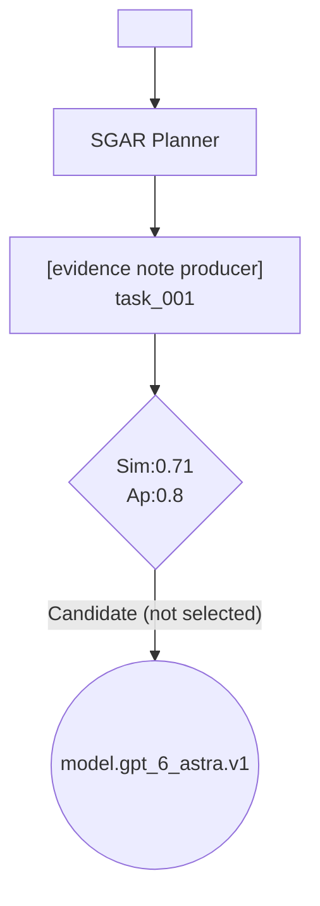

# S-GAR Pipeline Execution Report

**Query**: `<task-query sha256=885175426df1064265378c315e8c2017891e3b30e584730f0817af9c5564e2ee utf8_bytes=881>`

**Environment profile**: docker_cli=`True` docker_daemon=`False` docker_ready=`False`

**Control model chain**: configured=`gpt-5.6-sol` available=`gpt-5.6-sol`

**Planner parse**: mode=`json_schema` requested=`json_schema` attempt=`1` control_model=`gpt-5.6-sol`

## Replan History

- replan_count=`0` protected=`task_001` subtasks=`task_001:markdown.md`

## 1. Task Decomposition (Planner)

| ID | Role | Description | Artifact | Dependencies |
| -- | ---- | ----------- | -------- | ------------ |
| `task_001` | **evidence note producer** | Treat this as one indivisible final-output subtask; do not create a... | `markdown` | none |

## 2. Orchestration Graph

## 3. Retrieval & Candidate Pool

### task_001

- Revision: graph=`0` | subtask=`task_001` | subtask_revision=`0`
- Candidate pool hash: `68b9f2dc59b0150e0d75c492433d61a2e67777071bb49a08edd47f47cc8f92e4`
- Retrieval evidence hash: `6dbfa83d53c0fd8d5b8ec592b0a399344a1595755f8b894e1b63661dba6a2ad4`
- HyDE profile hash: `1a4724a27d9ca0aae3e77e2696d831619257c438dcbc5ccc47efd96c98a44950`
- Confidence: calibration=`unconfigured` | quota_coverage=`True` | contract_coverage=`True` | dependency_coverage=`True`
- HyDE accounting reference: `{'operation_id': '017d6e3e044d41f486d39e06aafeffb3', 'provider_attempt_id': '017d6e3e044d41f486d39e06aafeffb3:1', 'provider_attempt_ids': ['017d6e3e044d41f486d39e06aafeffb3:1']}`
- Candidate-pool artifact: `candidate_pools/0_task_001_0.json`
- Type quotas (base retrieval is not reduced by dependency closure):
  - Model: quota=`5` | eligible=`16` | base=`5` | final=`6` | shortfall=`0`
  - Tool: quota=`10` | eligible=`138` | base=`10` | final=`10` | shortfall=`0`
  - Skill: quota=`8` | eligible=`154` | base=`8` | final=`9` | shortfall=`0`
  - Agent: quota=`3` | eligible=`20` | base=`3` | final=`5` | shortfall=`0`
  - Resource: quota=`0` | eligible=`0` | base=`0` | final=`0` | shortfall=`0`
  - Device: quota=`0` | eligible=`0` | base=`0` | final=`0` | shortfall=`0`
- Dependency closure: edges=`30` | rejections=`0` | optional_hints=`45`
- Interpretation: these are frozen **candidates**, not resources selected by the Plan Compiler.

## 4. Sealed Executable Plan Compilation

### task_001

- Status: `failed`
- Artifact hash: `85a820f4cf1638e7c23e8d72abc45f662fbffb4086a737de29d0cf089eb6778f`
- Candidate pool hash: `68b9f2dc59b0150e0d75c492433d61a2e67777071bb49a08edd47f47cc8f92e4`
- Compiler input hash: `8940cceb5bab917e6f6c45f8f4ca5231ffd9a31dec9cc0468190a76c8fee5c00`
- Accounting operation: `plan_compiler:efe2608e382fa9f3a2f143923a47b2968c7d0389d8bee30c2f1a95db7fede988:semantic:2`
- Execution accounting operations: `none`
- Transport attempts: `1`
- Checked Compiler payloads: `0`

## 5. Compatibility Candidate Projection

This compatibility view reports one retrieved candidate for older visualizations; it is not the Plan Compiler's selected resource.

- **task_001** -> candidate_mode=`SEMI_GENERATIVE_MODE` -> candidate=`model.gpt_6_astra.v1`

## 6. Runtime RoutingSession Trace

### task_001

- Policy expected mode: `N/A`
- Actual runtime mode: `N/A`
- Fallback used: `False`
- Execution outcome: status=`structured_failure` | strictness=`balanced` | category=`unknown` | type=`plan_compiler_response_shape_invalid` | graph_replan_allowed=`False`
- Attempts:

#### Recovery

- Status: `research_failure`
- Plan adaptations: `0`
- Full Generation attempts: `0`
- Reused checkpoints: `0`
- Plan artifact hashes: `85a820f4cf1638e7c23e8d72abc45f662fbffb4086a737de29d0cf089eb6778f`
- Failure evidence hashes: `none`
- Temporary Tool artifact hashes: `none`
- Evaluator handoff is one-way; evaluator feedback is not returned to recovery.

#### Evaluation and Artifact Lifecycle

- not_run

<!-- SGAR_MODEL_COST_START -->
## Model Cost

- Observed model cost (USD): `$0.335949390000`
- Provider-reported cost complete: `True`
- Pricing catalog: `221b024c487460ca1e991d64d8e64245ab80716970fd7eee4efb7abd749a47aa`
- Tokens: input=`124149`, cache=`61184`, output=`22471`
- Budget: mode=`stop_after_limit`, warning=`False`, limit_reached=`False`, overshoot_usd=`0.000000000000`
- Incomplete accounting: missing_usage=`0`, invalid_usage=`0`, no_response=`0`, pending=`0`

| Stage | Attempts | Input | Cache | Output | Observed USD |
| ----- | -------- | ----- | ----- | ------ | ------------ |
| `plan_compiler` | 2 | 114282 | 61184 | 17817 | 0.272365740000 |
| `planner_decompose` | 1 | 7725 | 0 | 1736 | 0.029177550000 |
| `retrieval_hyde` | 1 | 2142 | 0 | 2918 | 0.034406100000 |

<!-- SGAR_MODEL_COST_END -->

<!-- SGAR_RESOURCE_EXECUTION_START -->
## Resource Execution

- Protocol: `sgar-execution-events-v1`
- Calls: started=`0`, terminal=`0`
- Complete: `True`
- Artifacts registered: `0`
- Ledger SHA-256: `e3b0c44298fc1c149afbf4c8996fb92427ae41e4649b934ca495991b7852b855`
- Unmatched calls: `0`

| Status | Count |
| ------ | ----- |

<!-- SGAR_RESOURCE_EXECUTION_END -->

<!-- SGAR_RECOVERY_START -->
## Recovery

- Protocol: `sgar-recovery-events-v1`
- Complete: `True`
- Terminal operations: `1`
- Adaptation starts: `0`
- Full Generation starts: `0`
- Checkpoint reuse events: `0`
- Temporary Tool generations: `0`
- Observed Recovery model cost (USD): `$0.098611290000`
- Recovery cost complete: `True`
- Ledger SHA-256: `4139854ea62329852d6fcf217163412dba7eda1ff8689007b7a03731aa7e0d15`
- Host path occurrences: `0`
- Hidden value occurrences: `0`

<!-- SGAR_RECOVERY_END -->

<!-- SGAR_EVALUATION_ARTIFACT_START -->
## Evaluation and Artifact Publication

- Evaluation protocol: `sgar-evaluation-events-v1`
- Initial evaluations: `0`
- Evidence reviews: `0`
- Evaluation operations complete: `True`
- Artifacts staged: `0`
- Artifacts verified: `0`
- Artifacts committed: `0`
- Artifacts quarantined: `0`
- Unmatched evaluation operations: `0`
- Unmatched artifact operations: `0`
- Unmatched Context commits: `0`
- Evaluation ledger SHA-256: `4f53cda18c2baa0c0354bb5f9a3ecbe5ed12ab4d8e11ba873c2f11161202b945`
- Artifact ledger SHA-256: `4f53cda18c2baa0c0354bb5f9a3ecbe5ed12ab4d8e11ba873c2f11161202b945`
- Context ledger SHA-256: `4f53cda18c2baa0c0354bb5f9a3ecbe5ed12ab4d8e11ba873c2f11161202b945`

<!-- SGAR_EVALUATION_ARTIFACT_END -->
