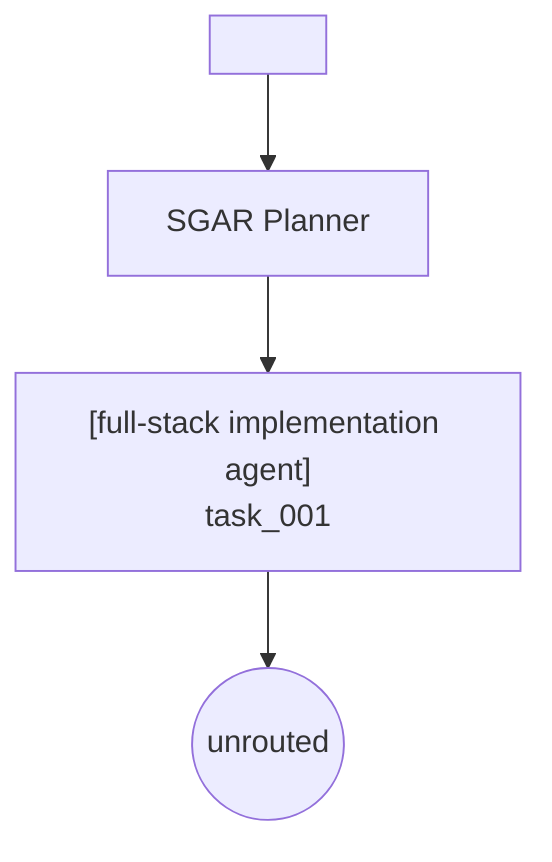

# S-GAR Pipeline Execution Report

**Query**: `<task-query sha256=c4a56a51189eca03d148c5f632354bf6bede5b52705c4e29b4ce005aa6c91f36 utf8_bytes=649>`

**Environment profile**: docker_cli=`True` docker_daemon=`False` docker_ready=`False`

**Control model chain**: configured=`gpt-5.6-sol` available=`gpt-5.6-sol`

**Planner parse**: mode=`json_schema` requested=`json_schema` attempt=`1` control_model=`gpt-5.6-sol`

## Replan History

- replan_count=`0` protected=`task_001` subtasks=`task_001:markdown.md`

## 1. Task Decomposition (Planner)

| ID | Role | Description | Artifact | Dependencies |
| -- | ---- | ----------- | -------- | ------------ |
| `task_001` | **full-stack implementation agent** | Treat this as one indivisible final-output subtask. Inspect the sup... | `markdown` | none |

## 2. Orchestration Graph

## 3. Retrieval & Candidate Pool

### task_001

- Terminal retrieval failure: code=`execution_requirement_resource_unavailable` | responsibility=`framework` | response_received=`False`

## 4. Sealed Executable Plan Compilation

### task_001

- Plan compilation has not completed.

## 5. Compatibility Candidate Projection

This compatibility view reports one retrieved candidate for older visualizations; it is not the Plan Compiler's selected resource.

- **task_001** -> `unrouted`

## 6. Runtime RoutingSession Trace

### task_001

No RoutingSession recorded.

#### Recovery

- Recovery has not completed.

#### Evaluation and Artifact Lifecycle

- not_run

<!-- SGAR_MODEL_COST_START -->
## Model Cost

- Observed model cost (USD): `$0.069508530000`
- Provider-reported cost complete: `True`
- Pricing catalog: `221b024c487460ca1e991d64d8e64245ab80716970fd7eee4efb7abd749a47aa`
- Tokens: input=`10299`, cache=`4608`, output=`5667`
- Budget: mode=`stop_after_limit`, warning=`False`, limit_reached=`False`, overshoot_usd=`0.000000000000`
- Incomplete accounting: missing_usage=`0`, invalid_usage=`0`, no_response=`0`, pending=`0`

| Stage | Attempts | Input | Cache | Output | Observed USD |
| ----- | -------- | ----- | ----- | ------ | ------------ |
| `planner_decompose` | 1 | 8304 | 3456 | 4051 | 0.050762160000 |
| `retrieval_hyde` | 1 | 1995 | 1152 | 1616 | 0.018746370000 |

<!-- SGAR_MODEL_COST_END -->

<!-- SGAR_RESOURCE_EXECUTION_START -->
## Resource Execution

- Protocol: `sgar-execution-events-v1`
- Calls: started=`0`, terminal=`0`
- Complete: `True`
- Artifacts registered: `0`
- Ledger SHA-256: `e3b0c44298fc1c149afbf4c8996fb92427ae41e4649b934ca495991b7852b855`
- Unmatched calls: `0`

| Status | Count |
| ------ | ----- |

<!-- SGAR_RESOURCE_EXECUTION_END -->

<!-- SGAR_RECOVERY_START -->
## Recovery

- Protocol: `sgar-recovery-events-v1`
- Complete: `False`
- Terminal operations: `0`
- Adaptation starts: `0`
- Full Generation starts: `0`
- Checkpoint reuse events: `0`
- Temporary Tool generations: `0`
- Observed Recovery model cost (USD): `$0.000000000000`
- Recovery cost complete: `True`
- Ledger SHA-256: `4f53cda18c2baa0c0354bb5f9a3ecbe5ed12ab4d8e11ba873c2f11161202b945`
- Host path occurrences: `0`
- Hidden value occurrences: `0`

<!-- SGAR_RECOVERY_END -->

<!-- SGAR_EVALUATION_ARTIFACT_START -->
## Evaluation and Artifact Publication

- Evaluation protocol: `sgar-evaluation-events-v1`
- Initial evaluations: `0`
- Evidence reviews: `0`
- Evaluation operations complete: `True`
- Artifacts staged: `0`
- Artifacts verified: `0`
- Artifacts committed: `0`
- Artifacts quarantined: `0`
- Unmatched evaluation operations: `0`
- Unmatched artifact operations: `0`
- Unmatched Context commits: `0`
- Evaluation ledger SHA-256: `4f53cda18c2baa0c0354bb5f9a3ecbe5ed12ab4d8e11ba873c2f11161202b945`
- Artifact ledger SHA-256: `4f53cda18c2baa0c0354bb5f9a3ecbe5ed12ab4d8e11ba873c2f11161202b945`
- Context ledger SHA-256: `4f53cda18c2baa0c0354bb5f9a3ecbe5ed12ab4d8e11ba873c2f11161202b945`

<!-- SGAR_EVALUATION_ARTIFACT_END -->
